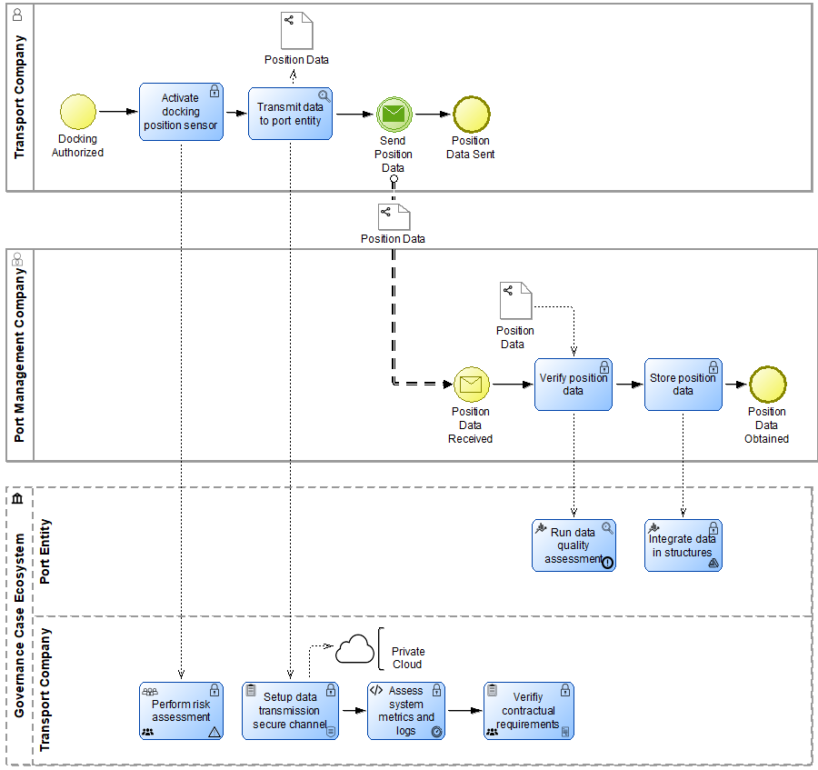
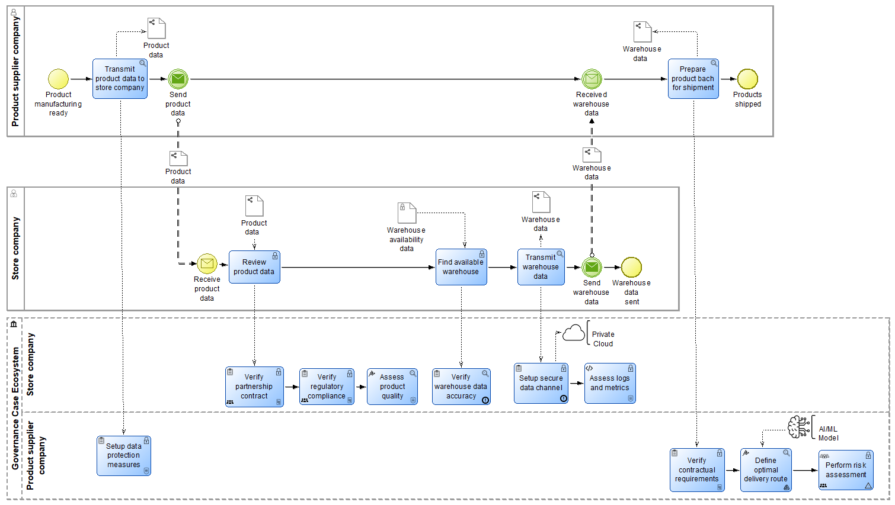
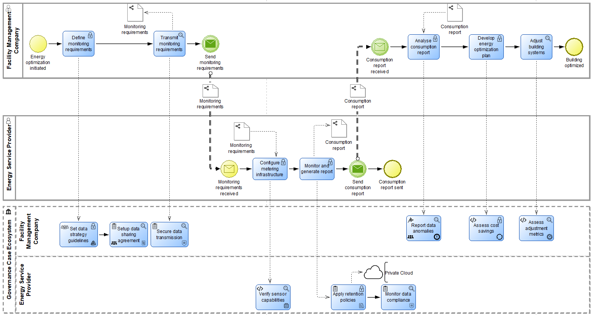

# IO-BPG BPMN Extension

The IO-BPG (Inter-Organizational Business Process Governance) is a BPMN extension proposed by Ribeiro et al. [1], and its main focus is to capture governance aspects in inter-organizational business processes, which are not explicitly represented by the standard BPMN.

## Repository contents

This repository will include the packaged IO-BPG modelling tool developed in ADOxx [2]. The package will allow users to install and use the tool on their own devices. It will also include the ADOxx library containing the IO-BPG metamodel and example models created with the tool. 

## Tool structure

The tool does not introduce new BPMN elements. It enriches the existing ones with governance-specific attributes. 

An IO-BPG scenario includes a main business process, which describes the workflow between network partners. Each partner can act as a Leader or Participant in the process. The partners can also share data between them using a Data Flow arrow, rather than a Message Flow arrow, which focuses on exchanging messages. The tool also provides additional data object and resource types, including private or shared data, personal or non-personal data, Cloud resources, and AI/ML models.

To represent governance aspects, IO-BPG provides a Virtual Inter-Organizational Governance Pool, with lanes corresponding to the partners involved in the main process. The pool contains governance tasks, which are associated with the corresponding tasks from the main process. A task from the main process can have one or more governance-related tasks associated with it. 

For each governance task, the user can specify the governance role, governance operation, traceability, and whether the task is collaborative, meaning that it requires collaboration with another network partner.

All these attributes are represented graphically within the BPMN elements.

## Scenario examples

### 1. Port Management scenario

This scenario describes the geographical location determination between a transport company and a port management company. It was originally proposed by Ribeiro et al. [1] and modeled in ADOxx in [3].

### 2. Store-Supplier Collaboration scenario

Described in [3], the second scenario captures the collaboration between a store company and a supplier, which exchange product and warehouse data in order to identify an available warehouse and prepare the products for shipment.

### 3. Energy Optimization scenario

The third scenario illustrates a Facility Management Company and an Energy Service Provider which collaborate to optimize the energy consumption of an office building based on measured consumption data.

## References
[1] V. H. Ribeiro, J. Barata, P. R. da Cunha, Modeling inter-organizational business process governance in the age of collaborative networks, in: Electronic Markets 34, 2024, article 51, https://doi.org/10.1007/s12525-024-00730-2 

[2] BOC GmbH, The ADOxx Metamodelling Platform, 2026, URL: https://adoxx.org/  

[3] T. M. Grigorovici, A Knowledge Graph Treatment to the IO-BPG Extension of BPMN, in: Proceedings of ISD 2026, AIS eLibrary, 2026 (in press)
